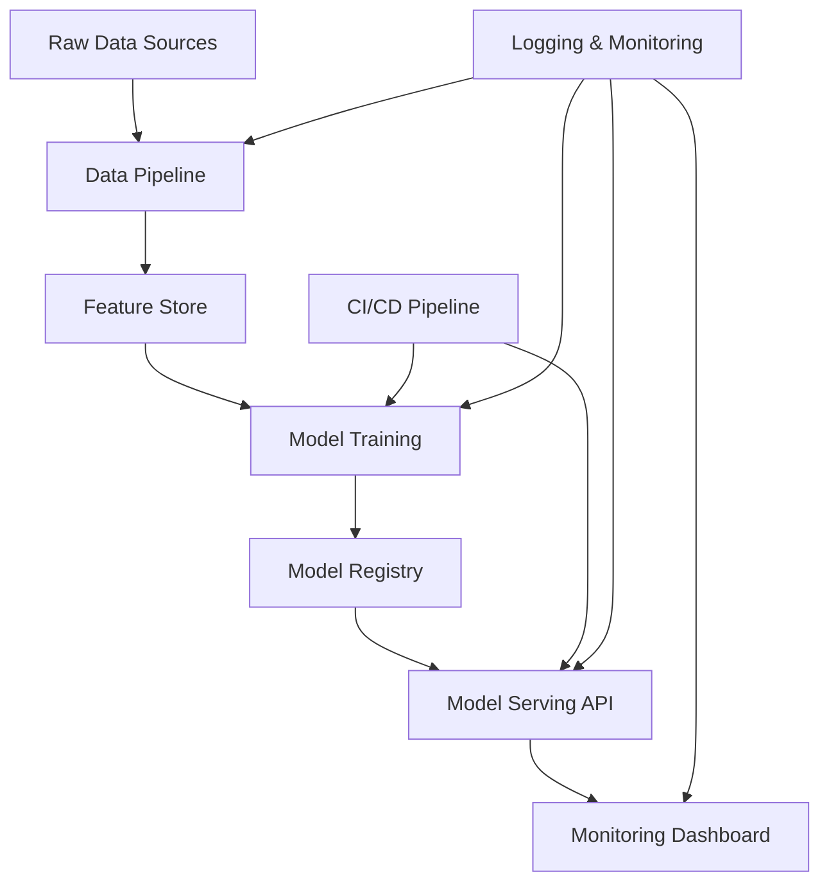

# Design Document

## Overview

Sistema de scoring de riesgo crediticio end-to-end que implementa un pipeline completo desde ingesta de datos hasta deployment en producción. El sistema está diseñado para demostrar capacidades de arquitecto de ML utilizando tecnologías modernas pero sin overkill, enfocándose en robustez, escalabilidad y mantenibilidad.

### Key Design Principles
- **Simplicidad efectiva**: Usar las herramientas justas y necesarias
- **Observabilidad**: Todo debe ser monitoreable y debuggeable
- **Reproducibilidad**: Pipelines determinísticos y versionados
- **Escalabilidad horizontal**: Diseño que permita crecer sin refactoring mayor

## Architecture

### High-Level Architecture



### Technology Stack Selection

**Core Stack**
- **Python 3.9+**: Lenguaje principal
- **Pandas/NumPy**: Manipulación de datos
- **Scikit-learn**: ML clásico y pipelines
- **XGBoost/LightGBM**: Modelos de boosting para datos tabulares
- **FastAPI**: API REST moderna y rápida para el servicio de inferencia
- **Docker**: Containerización con imágenes multi-etapa para optimización

**MLOps & Cloud Stack**
- **Cloud Provider**: Google Cloud Platform (GCP)
- **CI/CD**: GitHub Actions para automatizar pruebas, construcción de imágenes y despliegue
- **Model Serving**: Cloud Run para un despliegue serverless, escalable y costo-eficiente
- **Monitoring**: Vertex AI Model Monitoring para la detección automática de drift
- **Dashboard**: Streamlit para la visualización de resultados para stakeholders

## Components and Interfaces

### 1. Data Pipeline Component

**Responsabilidad**: Procesar el dataset de Home Credit y generar features

**Estructura de archivos**:
```
src/data/
├── __init__.py
├── make_dataset.py       # Pipeline principal de datos
├── ingestion.py          # Carga de CSVs
├── preprocessing.py      # Limpieza y transformación
└── validation.py         # Validación de calidad
```

**Key Features**:
- Procesamiento de múltiples tablas del dataset Home Credit
- Feature engineering específico para riesgo crediticio:
  - Ratios financieros (debt-to-income, credit utilization)
  - Features temporales (días desde última aplicación)
  - Features agregadas de bureau data
  - Encoding de variables categóricas
- Validación de calidad de datos

**Interface**:
```python
class DataPipeline:
    def process_raw_data(self, data_path: str) -> pd.DataFrame
    def engineer_features(self, df: pd.DataFrame) -> pd.DataFrame
    def validate_data_quality(self, df: pd.DataFrame) -> Dict[str, Any]
```

### 2. Feature Engineering Component

**Responsabilidad**: Transformar datos raw en features ML-ready

**Estructura**:
```
src/features/
├── __init__.py
└── build_features.py     # Pipeline de feature engineering
```

**Key Features**:
- FeatureEngineer class con métodos fit/transform
- Creación de features específicas para riesgo crediticio
- Pipeline de preprocessing con sklearn
- Serialización de pipelines para producción

### 3. Model Training Component

**Responsabilidad**: Entrenar, evaluar y seleccionar el mejor modelo

**Estructura**:
```
src/models/
├── __init__.py
├── train_model.py        # Pipeline principal de entrenamiento
├── evaluate_model.py     # Evaluación de modelos
├── predict_model.py      # Inferencia
└── base_model.py         # Clase base abstracta
```

**Key Features**:
- Implementación de múltiples algoritmos con interface común
- Métricas específicas para riesgo crediticio (AUC-ROC, AUC-PR, Gini coefficient)
- Validación cruzada estratificada
- Model explainability con SHAP

**Interface**:
```python
class BaseModel(ABC):
    @abstractmethod
    def train(self, X: pd.DataFrame, y: pd.Series) -> None
    @abstractmethod
    def predict_proba(self, X: pd.DataFrame) -> np.ndarray
    @abstractmethod
    def get_feature_importance(self) -> Dict[str, float]
```

### 4. Model Serving API

**Responsabilidad**: Servir predicciones en tiempo real

**Estructura**:
```
src/api/
├── __init__.py
├── main.py              # FastAPI app
├── models.py            # Pydantic models
├── scoring.py           # Lógica de scoring
└── middleware.py        # Logging, auth, etc.
```

**Key Features**:
- API REST con FastAPI
- Validación de input con Pydantic
- Caching de modelo en memoria
- Rate limiting básico
- Health checks
- Structured logging

**Endpoints**:
```
POST /score - Calcular score individual
POST /batch_score - Scoring en lote
GET /health - Health check
GET /model_info - Información del modelo activo
```

## Data Models

### Input Data Schema

Basado en el dataset de Home Credit Default Risk:

```python
@dataclass
class ApplicationData:
    # Demographic info
    code_gender: str
    days_birth: int
    days_employed: int
    
    # Financial info
    amt_income_total: float
    amt_credit: float
    amt_annuity: float
    
    # Application info
    name_contract_type: str
    name_income_type: str
    name_education_type: str
    
    # Derived features (post feature engineering)
    credit_income_ratio: float
    employment_length_years: float
    age_years: int
```

### Model Output Schema

```python
@dataclass
class ScoringResult:
    application_id: str
    risk_score: int  # 0-1000 scale
    probability_default: float  # 0-1
    risk_tier: str  # "LOW", "MEDIUM", "HIGH"
    feature_contributions: Dict[str, float]
    model_version: str
    timestamp: datetime
```

## Error Handling

### Data Pipeline Errors
- **Missing files**: Graceful degradation con logging
- **Schema changes**: Validation con alerting
- **Data quality issues**: Quarantine de datos problemáticos

### Model Serving Errors
- **Model loading failures**: Fallback a modelo anterior
- **Prediction errors**: Return error code con logging
- **High latency**: Circuit breaker pattern

## Testing Strategy

### Unit Tests
- **Data pipeline**: Test cada función de transformación
- **Models**: Test training y prediction logic
- **API**: Test endpoints con datos mock

### Integration Tests
- **End-to-end pipeline**: Desde raw data hasta predicción
- **API integration**: Test con modelo real

### Performance Tests
- **API latency**: < 500ms para scoring individual
- **Throughput**: > 100 requests/second
- **Memory usage**: < 2GB para modelo en memoria

## Deployment Strategy

### Development Environment
- **Local development**: Docker Compose con PostgreSQL
- **Testing**: GitHub Actions con pytest

### Production Environment
- **API deployment**: Google Cloud Run (serverless)
- **Model storage**: Google Cloud Storage
- **Monitoring**: Cloud Logging + simple dashboard

### CI/CD Pipeline

```yaml
# .github/workflows/main.yml
name: ML Pipeline
on: [push, pull_request]

jobs:
  test:
    - Run unit tests
    - Run integration tests
    - Run model validation tests
  
  build:
    - Build Docker image
    - Push to registry
  
  deploy:
    - Deploy to staging
    - Run smoke tests
    - Deploy to production (if main branch)
```

## Security Considerations

### Data Protection
- **Encryption at rest**: Database encryption
- **Encryption in transit**: HTTPS/TLS
- **PII handling**: Minimal data retention, anonymization

### API Security
- **Authentication**: API keys o JWT tokens
- **Rate limiting**: Prevent abuse
- **Input validation**: Prevent injection attacks

## Performance Considerations

### Scalability
- **Horizontal scaling**: Stateless API design
- **Caching**: Model caching, prediction caching

### Latency Optimization
- **Model optimization**: Feature selection, model compression
- **API optimization**: Async processing donde sea posible

### Resource Management
- **Memory management**: Efficient data structures
- **CPU optimization**: Vectorized operations
- **Storage optimization**: Compressed model artifacts