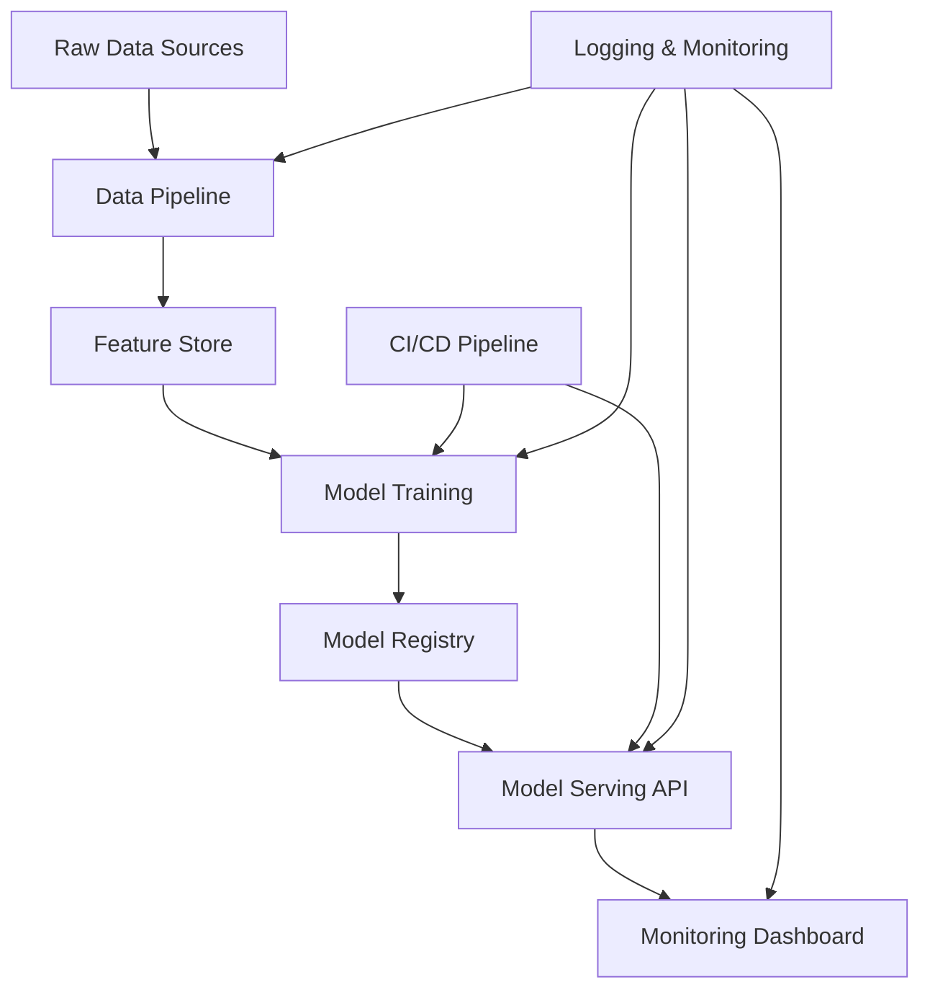
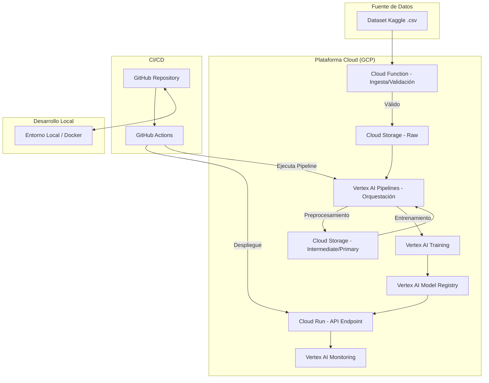

# Design Document

## Overview

Sistema de scoring de riesgo crediticio end-to-end que implementa un pipeline completo desde ingesta de datos hasta deployment en producción. El sistema está diseñado para demostrar capacidades de arquitecto de ML utilizando tecnologías modernas pero sin overkill, enfocándose en robustez, escalabilidad y mantenibilidad.

### Key Design Principles
- **Simplicidad efectiva**: Usar las herramientas justas y necesarias
- **Observabilidad**: Todo debe ser monitoreable y debuggeable
- **Reproducibilidad**: Pipelines determinísticos y versionados
- **Escalabilidad horizontal**: Diseño que permita crecer sin refactoring mayor

## Architecture

### High-Level Architecture



### GCP-Specific Architecture Flow

El siguiente diagrama muestra el flujo detallado de extremo a extremo en Google Cloud Platform:



### Technology Stack Selection (Reconciled with GCP Implementation)

**Core Stack (Nivel 1-2 del Blueprint)**
- **Python 3.9+**: Lenguaje principal
- **Pandas/NumPy**: Manipulación de datos
- **Scikit-learn**: ML clásico y pipelines
- **XGBoost/LightGBM**: Modelos de boosting para datos tabulares
- **FastAPI**: API REST moderna y rápida para el servicio de inferencia.
- **Cloud Storage (GCS)**: Almacenamiento principal para datasets en formato Parquet/CSV.

**MLOps & Cloud Stack (Nivel 3 del Blueprint - GCP Native)**
- **Cloud Provider**: Google Cloud Platform (GCP)
- **Containerization**: **Docker**, con imágenes multi-etapa para optimización.
- **CI/CD**: **GitHub Actions** para automatizar pruebas, construcción de imágenes y despliegue.
- **Orchestration**: **Vertex AI Pipelines** para definir, ejecutar y monitorear los flujos de trabajo de ML (entrenamiento, evaluación, etc.). Es el reemplazo gestionado y serverless de Airflow/Kubeflow para este proyecto.
- **Experiment Tracking & Model Registry**: **Vertex AI Experiments & Model Registry** para versionar modelos, parámetros y artefactos.
- **Model Serving**: **Cloud Run** para un despliegue serverless, escalable y costo-eficiente de la API de inferencia.
- **Monitoring**: **Vertex AI Model Monitoring** para la detección automática de drift de datos y predicciones.
- **Dashboard**: **Streamlit**, desplegado como un servicio separado (ej. en Cloud Run) para la visualización de resultados para stakeholders.

### Flujo de Datos en GCP

El movimiento de los datos a través del sistema está diseñado para garantizar la trazabilidad y la reproducibilidad:

1. **Capa Raw (`data/01_raw/`):** Los datos originales del dataset de Kaggle se cargan en un bucket de Google Cloud Storage (GCS). Esta capa es inmutable y sirve como la fuente única de verdad (`single source of truth`). Una Cloud Function se activa con la carga, realiza una validación de esquema básica y mueve el archivo a la zona `raw`.

2. **Capa Intermediate (`data/02_intermediate/`):** Los pipelines de Vertex AI consumen los datos de la capa `raw`. En esta etapa se realizan transformaciones más complejas, como la limpieza de datos, la imputación de valores faltantes y la unión de diferentes fuentes de datos. Los resultados se guardan en esta capa, a menudo en formatos más eficientes como Parquet.

3. **Capa Primary (`data/03_primary/`):** Aquí se realiza la ingeniería de características final. Los datos de la capa `intermediate` se transforman en los conjuntos de datos finales (features y target) que se utilizarán directamente para el entrenamiento y la evaluación del modelo. Esta capa contiene los datos limpios, agregados y listos para el consumo.

## Components and Interfaces

### 1. Data Pipeline Component

**Responsabilidad**: Procesar el dataset de Home Credit y generar features

**Estructura de archivos**:
```
src/data/
├── __init__.py
├── ingestion.py          # Carga de CSVs
├── preprocessing.py      # Limpieza y transformación
├── feature_engineering.py # Creación de features
└── validation.py         # Validación de calidad
```

**Key Features**:
- Procesamiento de múltiples tablas del dataset Home Credit
- Feature engineering específico para riesgo crediticio:
  - Ratios financieros (debt-to-income, credit utilization)
  - Features temporales (días desde última aplicación)
  - Features agregadas de bureau data
  - Encoding de variables categóricas
- Validación de calidad de datos con Great Expectations (simple)

**Interface**:
```python
class DataPipeline:
    def process_raw_data(self, data_path: str) -> pd.DataFrame
    def engineer_features(self, df: pd.DataFrame) -> pd.DataFrame
    def validate_data_quality(self, df: pd.DataFrame) -> Dict[str, Any]
```

### 2. Model Training Component

**Responsabilidad**: Entrenar, evaluar y seleccionar el mejor modelo

**Estructura**:
```
src/models/
├── __init__.py
├── base_model.py         # Clase base abstracta
├── xgboost_model.py      # Implementación XGBoost
├── lightgbm_model.py     # Implementación LightGBM
├── linear_model.py       # Regresión logística
├── ensemble.py           # Ensemble de modelos
└── evaluation.py         # Métricas específicas de riesgo
```

**Key Features**:
- Implementación de múltiples algoritmos con interface común
- Métricas específicas para riesgo crediticio:
  - AUC-ROC y AUC-PR
  - Gini coefficient
  - KS statistic
  - Profit curves
- Validación cruzada estratificada
- Hyperparameter tuning con Optuna (simple)
- Model explainability con SHAP

**Interface**:
```python
class BaseModel(ABC):
    @abstractmethod
    def train(self, X: pd.DataFrame, y: pd.Series) -> None
    @abstractmethod
    def predict_proba(self, X: pd.DataFrame) -> np.ndarray
    @abstractmethod
    def get_feature_importance(self) -> Dict[str, float]
```

### 3. Model Serving API

**Responsabilidad**: Servir predicciones en tiempo real

**Estructura**:
```
src/api/
├── __init__.py
├── main.py              # FastAPI app
├── models.py            # Pydantic models
├── scoring.py           # Lógica de scoring
└── middleware.py        # Logging, auth, etc.
```

**Key Features**:
- API REST con FastAPI
- Validación de input con Pydantic
- Caching de modelo en memoria
- Rate limiting básico
- Health checks
- Structured logging

**Endpoints**:
```
POST /score - Calcular score individual
POST /batch_score - Scoring en lote
GET /health - Health check
GET /model_info - Información del modelo activo
```

### 4. Monitoring and Observability

**Responsabilidad**: Monitorear performance y detectar drift

**Estructura**:
```
src/monitoring/
├── __init__.py
├── drift_detection.py   # Detección de drift
├── performance_tracker.py # Tracking de métricas
└── alerting.py          # Sistema de alertas
```

**Key Features**:
- Drift detection con statistical tests (KS test, PSI)
- Performance tracking en tiempo real
- Alerting simple (email/Slack webhook)
- Logging estructurado con Python logging

### 5. Dashboard Component

**Responsabilidad**: Visualización para stakeholders

**Estructura**:
```
src/dashboard/
├── __init__.py
├── app.py               # Streamlit app
├── charts.py            # Componentes de visualización
└── data_loader.py       # Carga de datos para dashboard
```

**Key Features**:
- Dashboard interactivo con Streamlit
- Métricas de performance en tiempo real
- Distribución de scores
- Feature importance plots
- Drift detection visualizations

## Data Models

### Input Data Schema

Basado en el dataset de Home Credit Default Risk:

```python
@dataclass
class ApplicationData:
    # Demographic info
    code_gender: str
    days_birth: int
    days_employed: int
    
    # Financial info
    amt_income_total: float
    amt_credit: float
    amt_annuity: float
    
    # Application info
    name_contract_type: str
    name_income_type: str
    name_education_type: str
    
    # Derived features (post feature engineering)
    credit_income_ratio: float
    employment_length_years: float
    age_years: int
```

### Model Output Schema

```python
@dataclass
class ScoringResult:
    application_id: str
    risk_score: int  # 0-1000 scale
    probability_default: float  # 0-1
    risk_tier: str  # "LOW", "MEDIUM", "HIGH"
    feature_contributions: Dict[str, float]
    model_version: str
    timestamp: datetime
```

### Database Schema

**Applications Table**:
```sql
CREATE TABLE applications (
    id SERIAL PRIMARY KEY,
    application_id VARCHAR(50) UNIQUE,
    raw_data JSONB,
    processed_features JSONB,
    created_at TIMESTAMP DEFAULT NOW()
);
```

**Predictions Table**:
```sql
CREATE TABLE predictions (
    id SERIAL PRIMARY KEY,
    application_id VARCHAR(50),
    risk_score INTEGER,
    probability_default FLOAT,
    model_version VARCHAR(50),
    created_at TIMESTAMP DEFAULT NOW(),
    FOREIGN KEY (application_id) REFERENCES applications(application_id)
);
```

## Error Handling

### Data Pipeline Errors
- **Missing files**: Graceful degradation con logging
- **Schema changes**: Validation con alerting
- **Data quality issues**: Quarantine de datos problemáticos

### Model Serving Errors
- **Model loading failures**: Fallback a modelo anterior
- **Prediction errors**: Return error code con logging
- **High latency**: Circuit breaker pattern

## Testing Strategy

### Unit Tests
- **Data pipeline**: Test cada función de transformación
- **Models**: Test training y prediction logic
- **API**: Test endpoints con datos mock

### Integration Tests
- **End-to-end pipeline**: Desde raw data hasta predicción
- **API integration**: Test con modelo real
- **Database operations**: Test CRUD operations

### Performance Tests
- **API latency**: < 500ms para scoring individual
- **Throughput**: > 100 requests/second
- **Memory usage**: < 2GB para modelo en memoria

### Model Tests
- **Data drift tests**: Automated drift detection
- **Model performance tests**: Minimum AUC threshold
- **Feature importance stability**: Consistency checks

## Deployment Strategy

### Development Environment
- **Local development**: Docker Compose con PostgreSQL
- **Testing**: GitHub Actions con pytest
- **Model experiments**: MLflow tracking local

### Production Environment
- **API deployment**: Google Cloud Run (serverless)
- **Database**: Cloud SQL PostgreSQL
- **Model storage**: Google Cloud Storage
- **Monitoring**: Cloud Logging + simple dashboard

### CI/CD Pipeline

```yaml
# .github/workflows/main.yml
name: ML Pipeline
on: [push, pull_request]

jobs:
  test:
    - Run unit tests
    - Run integration tests
    - Run model validation tests
  
  build:
    - Build Docker image
    - Push to registry
  
  deploy:
    - Deploy to staging
    - Run smoke tests
    - Deploy to production (if main branch)
```

### Blue-Green Deployment
- **Two identical environments**: Blue (current) y Green (new)
- **Traffic switching**: Gradual con health checks
### Estrategia de MLOps

La estrategia de MLOps se centra en la automatización y la reproducibilidad desde el principio:

- **Integración Continua / Despliegue Continuo (CI/CD): GitHub Actions**
  - Se configurarán workflows para:
    1. **CI:** Ejecutar automáticamente pruebas unitarias y de integración en cada `push` o `pull request`.
    2. **CD (Modelo):** Al fusionar a la rama principal (`main`), se podría lanzar automáticamente el pipeline de entrenamiento en Vertex AI para reentrenar el modelo.
    3. **CD (API):** Al etiquetar una nueva versión, se construirá la imagen Docker de la API y se desplegará en Cloud Run.

- **Orquestación y Automatización:**
  - Como se mencionó, `Vertex AI Pipelines` será el núcleo de la automatización del flujo de ML. Los pipelines se definirán como código y se versionarán en el repositorio de Git.

- **Monitoreo de Modelos:**
  - Se utilizará `Vertex AI Model Monitoring` para rastrear el rendimiento del modelo desplegado. Se configurarán alertas para detectar la deriva de datos (data drift) y la deriva de predicciones (prediction drift), lo que nos permitirá saber cuándo es necesario reentrenar el modelo.
- **Rollback capability**: Instant switch back si hay problemas

## Security Considerations

### Data Protection
- **Encryption at rest**: Database encryption
- **Encryption in transit**: HTTPS/TLS
- **PII handling**: Minimal data retention, anonymization

### API Security
- **Authentication**: API keys o JWT tokens
- **Rate limiting**: Prevent abuse
- **Input validation**: Prevent injection attacks

### Model Security
- **Model versioning**: Immutable model artifacts
- **Access control**: Role-based access
- **Audit logging**: Complete audit trail

## Performance Considerations

### Scalability
- **Horizontal scaling**: Stateless API design
- **Caching**: Model caching, prediction caching
- **Database optimization**: Proper indexing

### Latency Optimization
- **Model optimization**: Feature selection, model compression
- **API optimization**: Async processing donde sea posible
- **Infrastructure**: CDN para assets estáticos

### Resource Management
- **Memory management**: Efficient data structures
- **CPU optimization**: Vectorized operations
- **Storage optimization**: Compressed model artifacts

Este diseño balancea la demostración de habilidades técnicas con la practicidad, evitando el overkill mientras muestra dominio de las tecnologías clave del blueprint del arquitecto de ML.
